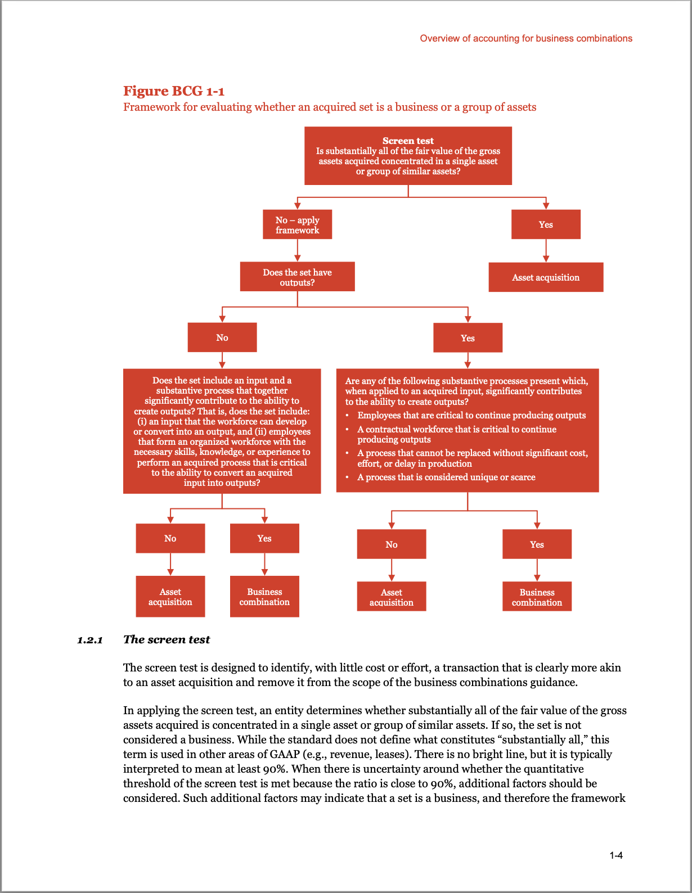

[https://binal.pub/2023/12/structured-ocr-with-gpt-vision/](https://binal.pub/2023/12/structured-ocr-with-gpt-vision/)

I'm continuously impressed with GPT Vision the more I use it. I've recently been working on a side project that involves parsing PDFs with embedded tables/images/flow charts for a RAG (retrieval augmented generation) chatbot, and found the most painful part to be dealing with parsing and structuring the PDFs.

There's a lot of knobs to mess with (query rewriting, chunking, embedding, retrieval process, reranking etc) which are all next to useless if the input text is garbled.

So I decided to throw one of the pages into GPT-V to see how it does.

First - it does a great job at OCR, which isn't super surprising given all it's other capabilities.

What I was pleasantly surprised by was that I could prompt it to output the OCRed text in an incredibly structured manner, doing things like having the model breakdown flowchart images into nodes and edges, or having it parse tables into rows and columns.


https://github.com/caesarnine/llm-experiments/assets/5447671/4cc2e771-0ec4-45ff-a8fd-562b68a520ad


### Why is this useful?

There's two parts to why this is useful:

1. We can intelligently chunk and embed our documents. Instead of naively chunking our text based on paragraphs or character limits, we can chunk the cohesive paragraphs/sections. During retrieval we can then retrieve any figures on the page whenever any one of those sections are retrieved.
2. We're representing figures and tables in a manner that's digestible for the downstream LLM. If a figure is retrieved then it has a well-structured flowchart/table that it can use to answer questions with.

### Structured OCR Output

Here's an example of what I mean.

I inputted this page from an Accounting Guideline from PWC that I found online:



And was able to generate this well structured output. Notice how even the flowchart was parsed into a DAG with individal nodes and decision points.

```
{
  "title": "Overview of accounting for business combinations",
  "page_number": 14,
  "sections": [
    {
      "title": "1.2.1 The screen test",
      "section": "1.2.1 The screen test",
      "text": "The screen test is designed to identify, with little cost or effort, a transaction that is clearly more akin to an asset acquisition and remove it from the scope of the business combinations guidance.\n\nIn applying the screen test, an entity determines whether substantially all of the fair value of the gross assets acquired is concentrated in a single asset or group of similar assets. If so, the set is not considered a business. While the standard does not define what constitutes “substantially all,” this term is used in other areas of GAAP (e.g., revenue, leases). There is no bright line, but it is typically interpreted to mean at least 90%. When there is uncertainty around whether the quantitative threshold of the screen test is met because the ratio is close to 90%, additional factors should be considered. Such additional factors may indicate that a set is a business, and therefore the framework should be applied."
    }
  ],
  "figures": [
    {
      "title": "Figure BCG 1-1",
      "figure_subtitle": "Framework for evaluating whether an acquired set is a business or a group of assets",
      "figure_number": 1,
      "figure_data": {
        "nodes": [
          {
            "id": "1",
            "description": "Screen test\nIs substantially all of the fair value of the gross assets acquired concentrated in a single asset or group of similar assets?",
            "connectors": [
              {
                "target_node_id": "2",
                "condition": "No – apply framework"
              },
              {
                "target_node_id": "3",
                "condition": "Yes"
              }
            ]
          },
          {
            "id": "2",
            "description": "Does the set have outputs?",
            "connectors": [
              {
                "target_node_id": "4",
                "condition": "No"
              },
              {
                "target_node_id": "5",
                "condition": "Yes"
              }
            ]
          },
          {
            "id": "3",
            "description": "Asset acquisition",
            "connectors": []
          },
          {
            "id": "4",
            "description": "Does the set include an input and a substantive process that together significantly contribute to the ability to create outputs? That is, does the set include: (i) an input that the workforce can develop or convert into an output, and (ii) employees that form an organized workforce with the necessary skills, knowledge, or experience to perform an acquired process that is critical to the ability to convert an acquired input into outputs?",
            "connectors": [
              {
                "target_node_id": "6",
                "condition": "No"
              },
              {
                "target_node_id": "7",
                "condition": "Yes"
              }
            ]
          },
          {
            "id": "5",
            "description": "Are any of the following substantive processes present which, when applied to an acquired input, significantly contributes to the ability to create outputs?\nEmployes that are critical to continue producing outputs\nA contractual workforce that is critical to continue producing outputs\nA process that cannot be replaced without significant cost, effort, or delay in production\nA process that is considered unique or scarce",
            "connectors": [
              {
                "target_node_id": "6",
                "condition": "No"
              },
              {
                "target_node_id": "7",
                "condition": "Yes"
              }
            ]
          },
          {
            "id": "6",
            "description": "Asset acquisition",
            "connectors": []
          },
          {
            "id": "7",
            "description": "Business combination",
            "connectors": []
          }
        ]
      }
    }
  ]
}
```

Here's the prompt I used (Python f-string) for the system prompt. I'll probably expand on it (for example include a real example versus the skeleton I have), but even the below seems to work quite well.

```text
You are an expert in PDFs. You are helping a user extract text from a PDF.

Extract the text from the image as a structured json output.

Extract the data using the following schema:

{Page.model_json_schema()}

Example:
{{
  "title": "Title",
  "page_number": 1,
  "sections": [
    ...
  ],
  "figures": [
    ...
  ]
}}
```

And here's the Pydantic model whose schema I inject above:

```python
class Section(BaseModel):
    title: str
    section: str
    text: str

class Connector(BaseModel):
    target_node_id: int
    condition: Optional[str] = None

class Node(BaseModel):
    id: int
    description: str
    connectors: list[Connector] = []

class Flowchart(BaseModel):
    nodes: list[Node]
    

class Figure(BaseModel):
    title: str
    figure_subtitle: str
    figure_number: int
    figure_data: Flowchart

class Page(BaseModel):
    title: str
    page_number: int
    sections: list[Section] = []
    figures: list[Figure] = []
```

